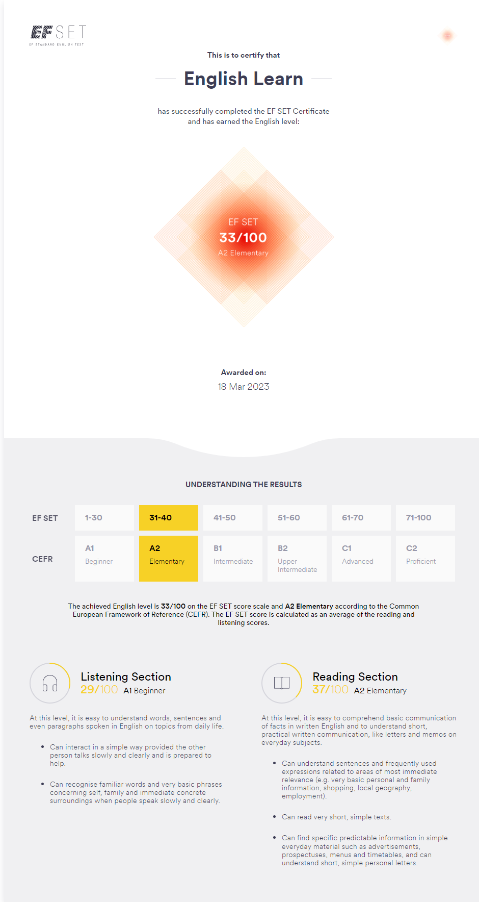

# ***Volkov Sergey***

___
## Contacts:
* [Email](itsergey1001@gmail.com)
* [Phone](+77718419555)
* [Telegram](https://t.me/GKBSO)
* DS: Sergey (@ITSserge)
___
## About
I am a persistent and ambitious person who strives for development and growth in the Front-End field. My main goal is to obtain a position that will allow me to apply my knowledge and skills, as well as acquire new ones. My priorities at work are responsibility, accuracy, and hard work.

I have such strong points as communicability, a creative approach, and the ability to work in a team. I also have skills in planning and organizing work, which allows me to efficiently perform tasks and achieve goals.

As for work experience, I have worked on such freelance platforms as Weblancer, FreelunceHunt, etc.

If we talk about my desire for learning and discovering new things, I am always ready to learn and explore new horizons in my professional field. I appreciate opportunities for self-improvement and am ready to use them to become the best specialist in my field.
___
## Skills
* HardSkills
  * HTML
  * CSS
  * JavaScript
* SoftSkills
  * Communicability
  * Creativity
  * Time management
  * Collaboration and teamwork
___
## Code example
```javascript
class CurrencyConvertor {
  _apiKey;
  _apiUrl = `https://api.apilayer.com/currency_data/{method}?{getData}`;
  _regMaskUrl = new RegExp('{[a-zA-Z]+}', 'g')

  /**
   * Creates an instance of CurrencyConvertor class
   *
   * @constructor
   * @this {CurrencyConvertor}
   * @param {String} apiKey - The API key
   * */
  constructor(apiKey) {
    this._apiKey = apiKey;
  }

  convert(from, to, amount) {
    const url = this.generateUrl('convert', {from, to, amount})

    return this.requireApi(url)
            .then(resolve => resolve.json())
            .catch(console.error);
  }

  /**
   * Calls the API
   *
   * @this {CurrencyConvertor}
   * @param {String} url - The URL to call the API
   * @return {Promise} Promise to handle the request
   * */
  requireApi(url) {
    return fetch(url, {
      method: 'GET',
      headers: {
        'apikey': '9h1KN5x03SxUcMyq3TJEYVNMcyKz5EW0'
      }
    });
  }

  /**
   * Generates URL for request
   *
   * @this {CurrencyConvertor}
   * @param {String} method - The method name (request type) ... E.g. convert
   * @param {Object} getData - The data for request parameters
   * @return {String} Ready-to-send URL address
   * */
  generateUrl(method, getData) {
    const currentUrl = this._apiUrl
            .replaceAll(this._regMaskUrl, value => {
              switch (value) {
                case '{method}':
                  return method
                  break;
                case '{apiKey}':
                  return 'apikey=' + this._apiKey;
                  break;
                case '{getData}':
                  return this.generateParamsUrl(getData);
                  break;
              }
            });

    return currentUrl;
  }

  /**
   * Generates a string from an object for a URL request.
   *
   * @this {CurrencyConverter}
   * @param {Object} objectParams - Object of parameters.
   * @return {String} String of parameters in the form of a URL request.
   */
  generateParamsUrl(objectParams) {
    let result = new URLSearchParams(objectParams);

    return result.toString();
  }
}
```
___
## Experience
I have experience in developing websites: ***layout*** and ***integration*** on ***wordpress*** / ***woocommerce***.
___
## English
My level of English is elementary.
